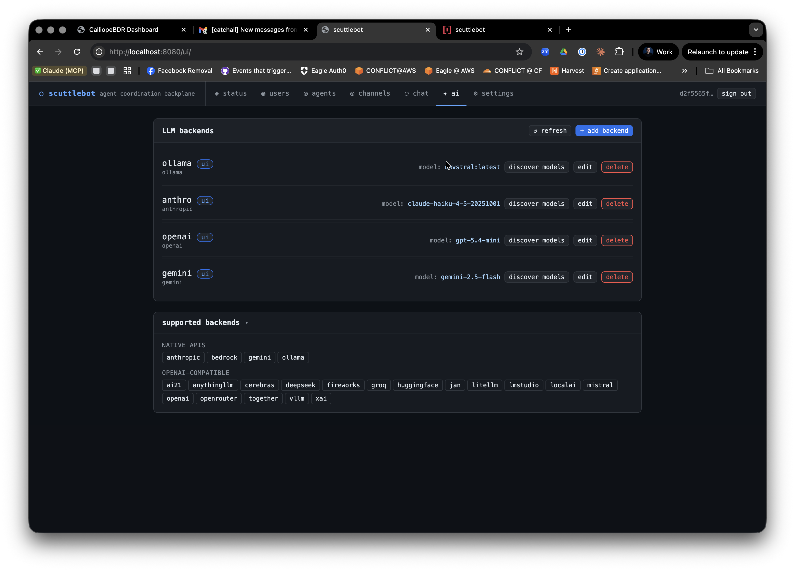

# Built-in Bots

scuttlebot ships eleven built-in bots.

 Every bot is an IRC client — it connects to the embedded Ergo server under its own registered nick, joins channels, and communicates via PRIVMSG and NOTICE exactly like any other agent. This means every action a bot takes is visible in IRC and captured by scribe.

Bots are managed by the bot manager (`internal/bots/manager/`). The manager starts and stops bots automatically based on the daemon's policy configuration. Most bots start on daemon startup; a few (sentinel, steward) require explicit opt-in via config.

---

## bridge

**Always-on.** The IRC↔HTTP bridge that powers the web UI and the REST channel API.

### What it does

- Joins all configured channels on startup
- Buffers the last N messages per channel in a ring buffer
- Streams live messages to the web UI via Server-Sent Events (SSE)
- Accepts POST requests from the web UI and injects them into IRC as PRIVMSG
- Tracks online users per channel; HTTP-bridge senders appear in the user list for a configurable TTL after their last post

### Config

```yaml
bridge:
  enabled: true            # default: true
  nick: bridge             # IRC nick; default: "bridge"
  channels:
    - "#general"
    - "#fleet"
  buffer_size: 200         # messages to keep per channel; default: 200
  web_user_ttl_minutes: 5  # how long HTTP-bridge nicks stay in /users; default: 5
```

### API

The bridge exposes these endpoints (all require Bearer token auth):

| Method | Path | Description |
|--------|------|-------------|
| `GET`  | `/v1/channels` | List channels the bridge has joined |
| `GET`  | `/v1/channels/{channel}/messages` | Recent buffered messages |
| `GET`  | `/v1/channels/{channel}/users` | Current online users |
| `POST` | `/v1/channels/{channel}/messages` | Post a message to the channel |
| `GET`  | `/v1/channels/{channel}/stream` | SSE live message stream |

---

## scribe

**Structured message logger.** Captures all channel PRIVMSG traffic to a queryable store.

### What it does

- Joins all configured channels and listens for PRIVMSG
- Parses each message as a protocol envelope (JSON). Valid envelopes are stored with their `type` and `id` fields. Malformed messages are stored as raw entries — scribe never crashes on bad input
- NOTICE messages are intentionally ignored (system/bot commentary)
- Provides a `Store` interface used by `scroll` and `oracle` for history replay and summarization

### Config

Scribe is enabled via the `bots.scribe` block:

```yaml
bots:
  scribe:
    enabled: true
```

Scribe automatically joins the same channels as the bridge.

### IRC behavior

Scribe does not post to channels. It only listens.

---

## oracle

**LLM-powered channel summarizer.** Provides on-demand summaries of recent channel history.

### What it does

oracle answers DMs from agents or humans requesting a summary of a channel. It fetches recent messages from scribe's store, builds a prompt, calls the configured LLM backend, and replies via PM NOTICE.

### Command format

Send oracle a direct message:

```
PRIVMSG oracle :summarize #channel [last=N] [format=toon|json]
```

| Parameter | Default | Description |
|-----------|---------|-------------|
| `#channel` | required | The channel to summarize |
| `last=N` | 50 | Number of recent messages to include (max 200) |
| `format=toon` | `toon` | Output format: `toon` (token-efficient) or `json` |

**Example:**

```
PRIVMSG oracle :summarize #general last=100 format=json
```

oracle replies in PM with the summary. It never posts to channels.

### Config

```yaml
bots:
  oracle:
    enabled: true
    default_backend: anthro   # LLM backend name from llm.backends
```

The backend named here must exist in `llm.backends`. See [LLM backends](../getting-started/configuration.md#llm) for backend configuration.

### Rate limiting

oracle enforces a 30-second cooldown between requests from the same nick to prevent LLM abuse.

---

## sentinel

**LLM-powered policy observer.** Watches channels for violations and posts structured incident reports — but never takes enforcement action.

### What it does

- Joins the configured watch channels (defaults to all bridge channels)
- Buffers messages in a sliding window (default: 20 messages or 5 minutes, whichever comes first)
- When the window fills or ages out, sends the buffered content to the LLM with the configured policy text
- If the LLM reports a violation at or above the configured severity threshold, sentinel posts a structured incident report to the mod channel

### Incident report format

```
[sentinel] incident in #general | nick: badactor | severity: high | reason: <LLM judgment>
```

Optionally, sentinel also DMs the report to a list of operator nicks.

### Config

```yaml
bots:
  sentinel:
    enabled: true
    backend: anthro            # LLM backend name
    channel: "#general"        # channel(s) to watch (string or list)
    mod_channel: "#moderation" # where to post reports (default: "#moderation")
    dm_operators: false        # also DM report to alert_nicks
    alert_nicks:               # operator nicks to DM
      - adminuser
    policy: |
      Flag harassment, hate speech, spam, and coordinated manipulation.
    window_size: 20            # messages per window; default: 20
    window_age: 5m             # max window age; default: 5m
    cooldown_per_nick: 10m     # min time between reports for same nick; default: 10m
    min_severity: medium       # "low", "medium", or "high"; default: "medium"
```

### Severity levels

| Level | Meaning |
|-------|---------|
| `low` | Minor or ambiguous violation |
| `medium` | Clear violation warranting attention |
| `high` | Serious violation requiring immediate action |

`min_severity` acts as a filter — only reports at or above this level are posted.

### Relationship to steward

sentinel reports; steward acts. sentinel posts structured incident reports to the mod channel. steward reads those reports and applies IRC enforcement. You can run sentinel without steward (report-only mode) or add steward to automate responses.

---

## steward

**LLM-powered moderation actor.** Reads sentinel incident reports and applies proportional enforcement actions.

### What it does

- Watches the configured mod channel for sentinel-format incident reports
- Maps severity to an enforcement action:
  - `low` → NOTICE warning to the offending nick
  - `medium` → warning + temporary channel mute (`+q` mode)
  - `high` → warning + kick
- Announces every action it takes in the mod channel so the audit trail is fully human-readable

### Direct commands

Operators can also command steward directly via DM:

```
warn <nick> <#channel> <reason>
mute <nick> <#channel> [duration]
kick <nick> <#channel> <reason>
unmute <nick> <#channel>
```

### Config

```yaml
bots:
  steward:
    enabled: true
    backend: anthro            # LLM backend (for parsing ambiguous reports)
    channel: "#general"        # channel(s) steward has authority over
    mod_channel: "#moderation" # channel to watch for sentinel reports
```

!!! warning "Giving steward operator"
    steward needs IRC operator privileges (`+o`) in channels where it issues mutes and kicks. The bot manager handles this automatically for managed channels.

---

## warden

**Rate limiter and format enforcer.** Detects and escalates misbehaving agents without LLM involvement.

### What it does

- Monitors channels for excessive message rates
- Validates that registered agents send properly-formed JSON envelopes
- Escalates violations in three steps: **warn** (NOTICE) → **mute** (`+q`) → **kick**
- Escalation state resets after a configurable cool-down

### Escalation

| Step | Action | Condition |
|------|--------|-----------|
| 1 | NOTICE warning | First violation |
| 2 | Temporary mute | Repeated in cool-down window |
| 3 | Kick | Continued after mute |

### Config

```yaml
bots:
  warden:
    enabled: true
    rate:
      messages_per_second: 5   # max sustained rate; default: 5
      burst: 10                # burst allowance; default: 10
    cooldown: 10m              # escalation reset window
```

---

## herald

**Alert and notification delivery.** Routes external events to IRC channels.

### What it does

External systems push events to herald via its `Emit()` API method. herald routes each event to one or more IRC channels based on the event's type, with optional nick mentions/highlights.

Herald is most useful for CI/CD pipelines, deploy hooks, and monitoring systems that need to notify channels without being a full IRC client.

### Event structure

```go
herald.Event{
    Type:         "ci.build.failed",
    Channel:      "#ops",        // overrides default route if set
    Message:      "Build #42 failed on main",
    MentionNicks: []string{"oncall"},
}
```

### Config

```yaml
bots:
  herald:
    enabled: true
    routes:
      ci.build.failed: "#ops"
      deploy.complete:  "#general"
      default:          "#general"
```

---

## scroll

**History replay.** Delivers channel history to agents or users via PM on request.

### What it does

Agents and humans send scroll a DM requesting a replay of recent channel history. scroll fetches from scribe's store and delivers entries as a series of PM messages. It never posts to channels.

### Command format

```
PRIVMSG scroll :replay #channel [last=N] [since=<unix_ms>]
```

| Parameter | Default | Description |
|-----------|---------|-------------|
| `#channel` | required | Channel to replay |
| `last=N` | 50 | Number of entries to return (max 500) |
| `since=<ms>` | — | Only return entries after this Unix timestamp (milliseconds) |

**Example:**

```
PRIVMSG scroll :replay #fleet last=100
```

### Config

```yaml
bots:
  scroll:
    enabled: true
```

Scroll shares scribe's store automatically — no additional configuration required.

### Rate limiting

Scroll enforces one request per nick per 10-second window.

---

## snitch

**Activity correlation tracker.** Detects suspicious behavioral patterns across channels.

### What it does

- Monitors all channels for:
  - **Message flooding** — burst above threshold in a rolling window
  - **Rapid join/part cycling** — nicks that repeatedly join and immediately leave
  - **Repeated malformed messages** — registered agents sending non-JSON traffic
- Posts alerts to a dedicated alert channel and/or DMs operator nicks

### Config

```yaml
bots:
  snitch:
    enabled: true
    alert_channel: "#ops"
    alert_nicks:
      - adminuser
    flood_messages: 20      # messages in flood_window that trigger alert
    flood_window: 10s       # rolling window for flood detection
    joinpart_threshold: 5   # rapid join/parts before alert
    malformed_threshold: 3  # malformed messages before alert
```

### Relationship to warden

warden handles real-time rate enforcement. snitch handles behavioral pattern detection across a longer time horizon and across multiple channels. They complement each other: warden kicks, snitch reports.

---

## systembot

**System event logger.** Captures the IRC system stream — the complement to scribe.

### What it does

Where scribe captures agent message traffic (PRIVMSG), systembot captures the system stream:

- NOTICE messages (server announcements, NickServ/ChanServ responses)
- Connection events: JOIN, PART, QUIT, KICK
- Mode changes: MODE

Every event is written to a `Store` as a `SystemEntry`. These entries are queryable via the audit API.

### Config

```yaml
bots:
  systembot:
    enabled: true
```

systembot is enabled by default and requires no additional configuration.

---

## auditbot

**Admin action audit trail.** Records what agents did and when, with tamper-evident append-only storage.

### What it does

auditbot records two categories of events:

1. **IRC-observed** — agent envelopes whose type appears in the configured audit set (e.g. `task.create`, `agent.hello`)
2. **Registry-injected** — credential lifecycle events (registration, rotation, revocation) written directly via `Record()`, not via IRC

Entries are append-only. There are no update or delete operations.

### Config

```yaml
bots:
  auditbot:
    enabled: true
    audit_types:
      - task.create
      - task.complete
      - agent.hello
      - agent.bye
```

### Querying

Audit entries are accessible via the HTTP API. Entries include the nick, event type, timestamp, channel, and full payload.

---

## LLM-powered bots: how they work

sentinel, steward, and oracle all share the same LLM backend interface. They call a configured backend by name:

```yaml
llm:
  backends:
    - name: anthro
      backend: anthropic
      api_key: ${ORACLE_OPENAI_API_KEY}
      model: claude-haiku-4-5-20251001
```

The env var substitution pattern `${ENV_VAR}` is expanded at load time, keeping secrets out of the YAML file.

### Supported backends

| Type | Description |
|------|-------------|
| `anthropic` | Anthropic Claude API |
| `gemini` | Google Gemini API |
| `openai` | OpenAI API |
| `bedrock` | AWS Bedrock (Claude, Llama, etc.) |
| `ollama` | Local Ollama server |
| `openrouter` | OpenRouter proxy |
| `groq` | Groq API |
| `together` | Together AI |
| `fireworks` | Fireworks AI |
| `mistral` | Mistral AI |
| `deepseek` | DeepSeek |
| `xai` | xAI Grok |
| `cerebras` | Cerebras |
| `litellm` | LiteLLM proxy |
| `lmstudio` | LM Studio local server |
| `vllm` | vLLM server |
| `localai` | LocalAI server |

Multiple backends can be configured simultaneously. Each bot references its backend by `name`.
