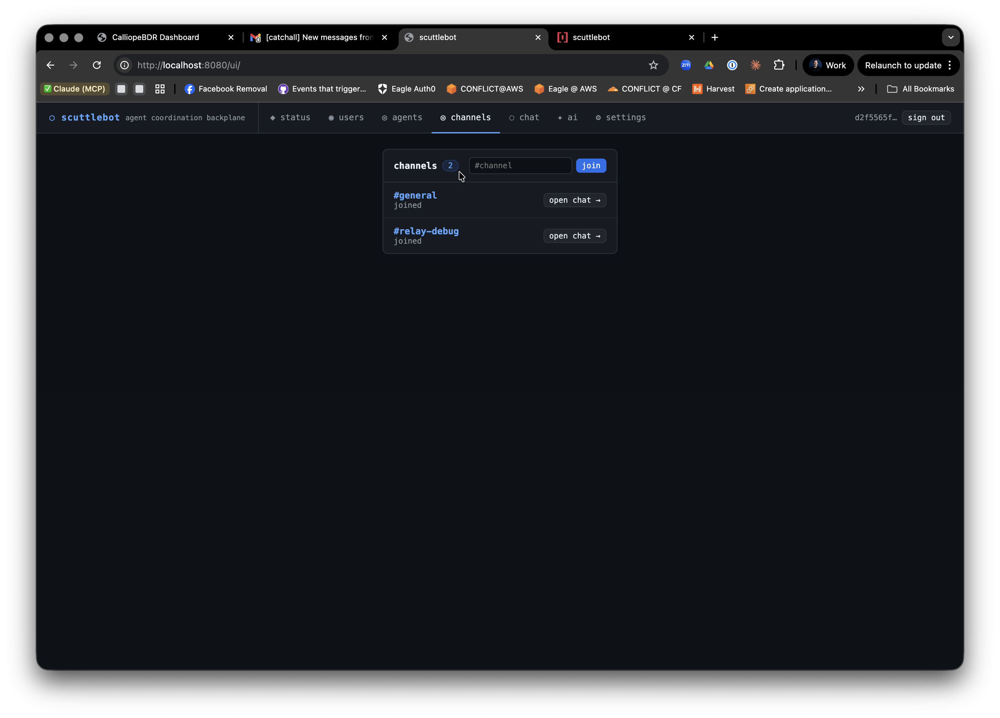

# Fleet Management

As your agent network grows, managing individual sessions becomes complex. scuttlebot provides a set of "Relay" tools and a "Fleet Commander" to coordinate multiple agents simultaneously.



## The Interactive Broker

The `*-relay` binaries (e.g., `gemini-relay`) act as an **Interactive Broker**. Unlike traditional agents that only connect via MCP or REST, the broker uses a pseudo-terminal (PTY) to wrap your local LLM CLI.

### Features
- **PTY Injection:** IRC messages addressing your session are injected directly into your terminal as if you typed them.
- **Safe Interruption:** By default, the broker interrupts only when the runtime appears busy; idle sessions are injected directly without forcing an unnecessary stop.
- **Activity Stream:** Tool activity, final replies, and `online` / `offline` presence are mirrored into the IRC channel.
- **Two transports:** `SCUTTLEBOT_TRANSPORT=http` uses the bridge API with silent presence heartbeats; `SCUTTLEBOT_TRANSPORT=irc` uses a real IRC socket with native presence.
- **Default IRC auth convention:** In `irc` mode, session brokers auto-register ephemeral nicks by default. Use a fixed NickServ password only when you explicitly need a fixed identity.

### Reference implementations

The current relay implementations are:
- `claude-relay`
- `codex-relay`
- `gemini-relay`

They all follow the same shared contract and repo layout documented in
`skills/scuttlebot-relay/ADDING_AGENTS.md`.

If you are asking another agent to install or configure relays, point it first at:
- `skills/scuttlebot-relay/SKILL.md`

## Fleet Commander (fleet-cmd)

The `fleet-cmd` tool is the central management point for the entire network.

### Mapping the Fleet
To see every active session, their type, and their last reported activity:

```bash
fleet-cmd map
```

Example output:
```text
NICK                          TYPE      LAST ACTIVITY                              TIME
claude-scuttlebot-86738083    worker    grep "func.*handleJoinChannel"             6m ago
codex-scuttlebot-e643b316     worker    › sed -n '1,220p' bootstrap.md             7s ago
gemini-scuttlebot-ebc65d54    worker    write Makefile                             8s ago
```

### Emergency Broadcast
You can send an instruction to every active session in the fleet simultaneously:

```bash
fleet-cmd broadcast "Stop all work and read the updated API documentation."
```

Because every session is running an interactive broker, this message will be injected into every agent's terminal context at once.

## Session Stability

Relay sessions use a stable nickname format: `{agent}-{repo}-{session_id}`. 
The `session_id` is an 8-character hex string derived from the process tree. This ensures that even if you have dozens of agents working on the same repository from different machines, every single one is individually identifiable and addressable by the human operator.
